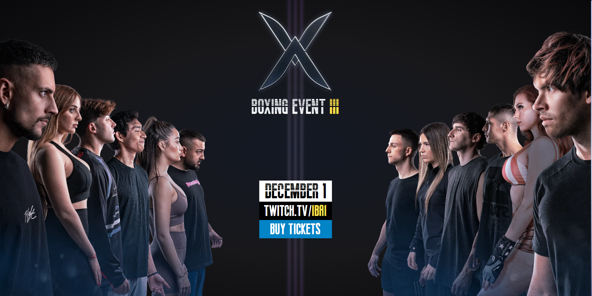

# Boxing Event Site

Welcome to the README for the Boxing Event website, one of the featured projects in my portfolio. This website was developed to provide information about an upcoming boxing event featuring popular Twitch streamers as participants.

## Overview

The Boxing Event website is built using modern web technologies to create an engaging and informative experience for users interested in the event. The website showcases event details, participant information, provides a direct link to the platform to watch the event live and another to buy tickets.

## Features

- Event Details: Learn about the event date, location, and other relevant information.
- Participant Profiles: Explore profiles of the Twitch streamers participating in the event.
- Links: Direct links to watch the event live and another to buy tickets.
- Responsive Design: The website is designed to be responsive and user-friendly across various devices.

## Technologies Used

- [Astro](https://astro.build/): A modern static site generator.
- JavaScript: Used for interactivity and dynamic content.
- [Tailwind CSS](https://tailwindcss.com/): A utility-first CSS framework for styling.
- HTML: The structural foundation of the website.
- CSS: Custom styling to enhance the visual appeal and user experience.

## Getting Started

1. Clone this repository: `git clone https://github.com/yourusername/boxing-event-site.git`
2. Navigate to the project folder: `cd boxingsite`
3. Install dependencies: `npm install`
4. Run the development server: `npm run dev`

## Live Demo

You can experience the Boxing Event website live by visiting [https://boxingevent.netlify.app/](https://boxingevent.netlify.app/).

## Screenshots

## Contact

If you have any questions, feedback, or inquiries about the Boxing Event website, feel free to reach out to me:

- Email: [bdressx@gmail.com](mailto:bdressx@gmail.com)
- LinkedIn: [Braulio Rosario](https://www.linkedin.com/in/braulio-rosario-rodriguez-815101218/)

Thank you for your interest in the Boxing Event website. I hope you enjoy exploring the project!